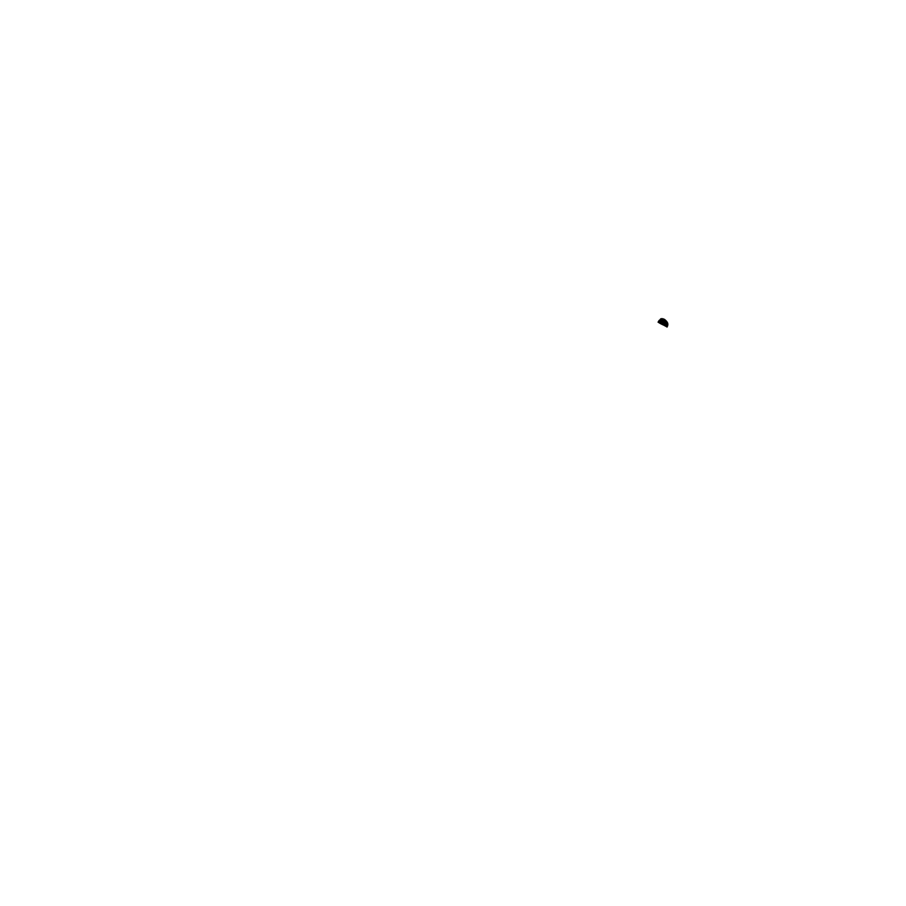
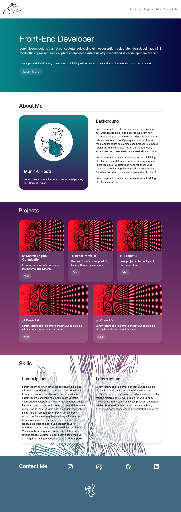

<a name="readme-top"></a>

<!-- PROJECT LOGO -->
<br />
<div align="center">
  <a href="https://github.com/github_username/repo_name">
    
  </a>

<h3 align="center">Project Portfolio</h3>

  <p align="center">
    Redesign of personal portfolio using Bootstrap
    <br />
    <a href="https://kuuyyaa.github.io/Bootstrap-Portfolio/">View Demo</a>
  </p>
</div>


<!-- TABLE OF CONTENTS -->
<details>
  <summary>Table of Contents</summary>
    <li>
      <a href="#about-the-project">About The Project</a>
      <ul>
    </li>
    <li>
      <a href="#getting-started">Getting Started</a>
      <ul>
        <li><a href="#prerequisites">Prerequisites</a></li>
        <li><a href="#installation">Installation</a></li>
      </ul>
    </li>
    <li><a href="#usage">Usage</a></li>
    <li><a href="#roadmap">Roadmap</a></li>
    <!-- <li><a href="#license">License</a></li> -->
    <li><a href="#contact">Contact</a></li>
    <!-- <li><a href="#acknowledgments">Acknowledgments</a></li> -->
</details>


<!-- ABOUT THE PROJECT -->
## About The Project
This is a redesign of a previous project [portfolio](https://kuuyyaa.github.io/02-portfolio/) made using bootstrap. Current content of the portfolio contains mainly filler text, which will be properly filled in a future commit. This portfolio will be used to introduce myself and showcase experience through previously completed projects. Here is a screenshot of the latest version of the template:




### Built With: 
![Bootstrap][Bootstrap.com] 


<p align="right">(<a href="#readme-top">back to top</a>)</p>


<!-- GETTING STARTED -->
## Getting Started

To get a local copy up and running follow these example steps.

### Prerequisites

In order to edit and personalise this template, a suitable IDE is required. It is recommended to use VSCode.

### Installation

1. Clone the repo
   ```sh
   git clone https://github.com/kuuyyaa/Bootstrap-Portfolio.git
   ```
2. Open and edit portfolio template using VSCode.

<p align="right">(<a href="#readme-top">back to top</a>)</p>


<!-- USAGE EXAMPLES -->
## Usage

Source code for this portfolio can be used as a template for deploying a personal project portfolio. As illustrations and animation(s) used in this version are created by me, please do not use them without permission.

_instagram: [@ku_yya](https://www.instagram.com/ku_yya/)_


<p align="right">(<a href="#readme-top">back to top</a>)</p>


<!-- ROADMAP -->
## Roadmap

- [February 2024] Complete portfolio content, which will include:
    - Detailed about me
    - A showcase of all completed projects

See the [open issues](https://github.com/kuuyyaa/Bootstrap-Portfolio/issues) for a full list of proposed features (and known issues).

<p align="right">(<a href="#readme-top">back to top</a>)</p>


<!-- ## License

Distributed under the MIT License. See `LICENSE.txt` for more information.

<p align="right">(<a href="#readme-top">back to top</a>)</p> -->


<!-- CONTACT -->
## Contact

Instagram: [@ku_yya](https://twitter.com/twitter_handle) - Connect through [LinkedIn](https://www.linkedin.com/in/munir-al-hooti-439967296)

Project Link: [https://github.com/kuuyyaa/Bootstrap-Portfolio](https://github.com/kuuyyaa/Bootstrap-Portfolio)

<p align="right">(<a href="#readme-top">back to top</a>)</p>


<!-- ## Acknowledgments

* []()
* []()
* []()

<p align="right">(<a href="#readme-top">back to top</a>)</p> -->


<!-- MARKDOWN LINKS & IMAGES -->
[Bootstrap.com]: https://img.shields.io/badge/Bootstrap-563D7C?style=for-the-badge&logo=bootstrap&logoColor=white
[Bootstrap-url]: https://getbootstrap.com
